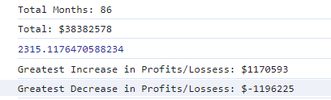

# Finance Calculation

## Description 

A javascript application that calculates different value based on a given set of data

## Table of Contents (Optional)

* [Installation](#installation)
* [Usage](#usage)
* [Credits](#credits)
* [License](#license)

## Installation

N/A

## Usage 

Various analysis are carried out using javascript and please see the screenshot for the output.

Link to application: https://github.com/ccc7321/console-finances

## Credits

Credits to Omar as the instructor of this course and ChatGPT for giving out the original code to give me some direction on how to code.

## License

Please refer to licence in the repo.

